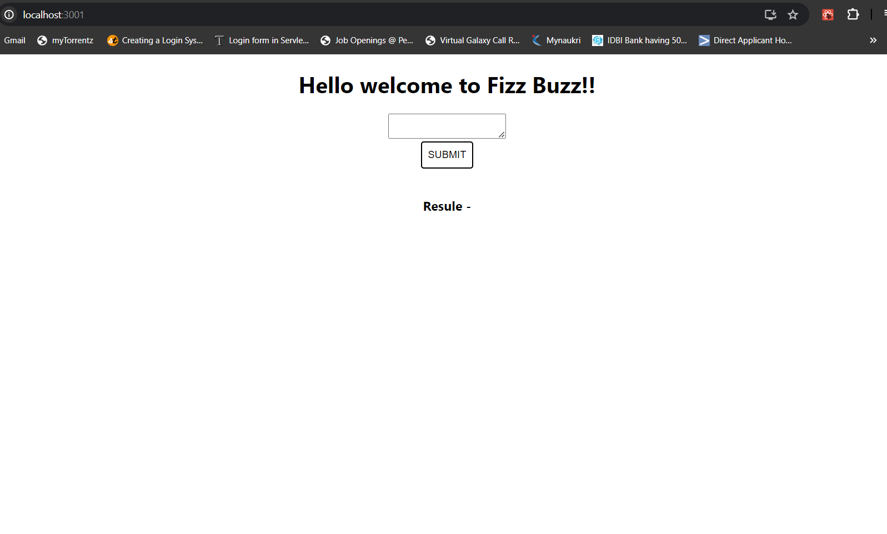
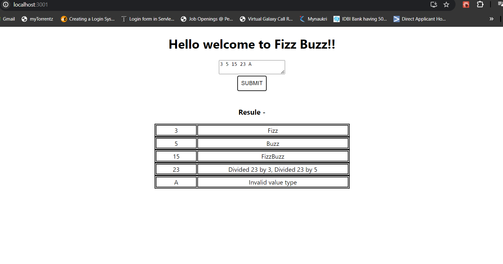

# Getting started with FizzBuzz App

This program will accept the data and find out the and convert it into the array. And provide the expected result.

Input - 3 5 15 23 A

OutPut -

#### Result

| 3 | Fizz |
| 5 | Buzz |
| 15 | FizzBuzz |
| 23 | Divide 23 by 3 , Divide 23 by 5 |

## Start the server

```
nodemon start

```

Server will start at 3000 port

## Start the client

```
    cd fizzbuzzfrontend
    npm start

    Would you like to run the app on another port instead? » yes
```

It will start the client at other than 3000 port.




